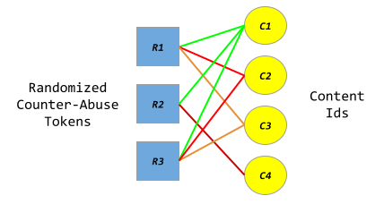

# Randomized Counter-Abuse Tokens Explainer

**Authors:** Adrian Isles (adrianisles@google.com); Philipp Pfeiffenberger
(philippp@google.com); David Turner (dbturner@google.com); Todd Patterson
(toddpatt@google.com)

Please provide feedback to rcat-discuss@googlegroups.com

## Motivation

Embedding of third-party content in websites and mobile apps is a popular and
effective technique for increasing user interest and engagement. The embedded
content could be a social media post, audio, video, or other types of
interactive media. In many cases, the content is owned by individual content
creators and not the third-party platform which hosts the content. In order to
protect the platform and provide creators with insight about how and where their
content is consumed, third-party hosting platforms must be able to measure user
engagement. For example, measuring the number of times users have listened,
viewed, clicked or otherwise interacted with the embedded content on each
top-level site. This allows for determining content and creator popularity,
which provides creators with a mechanism for receiving credit on the third-party
hosting platform ("content provider" hereafter).

A traditional approach for implementing this measurement involves third-party
cookies or other forms of client-side state. With third-party cookies, content
providers can store a persistent pseudonymous identifier (e.g. a visitor id) on
the client, which acts as a session key. Content providers can then aggregate
user events by visitor id to understand user behavior, including anomalous or
potentially abusive engagement. For example, the ability to differentiate
between 100 events from 100 distinct users versus 100 events from a single
malicious user is paramount for abuse modeling and detection.

To improve user privacy in these contexts, major browser vendors including
[Safari](https://webkit.org/tracking-prevention/),
[Mozilla](https://developer.mozilla.org/en-US/docs/Web/Privacy/State_Partitioning)
and [Chrome](https://github.com/privacycg/CHIPS), have adopted or have plans to
adopt client-side state partitioning by top-level site. Partitioning in this
manner prevents client-side state from being shared across top-level sites,
which prevents cross-site tracking. Despite these privacy improvements, there
are still websites and apps that prefer stateless third-party embeddings in
which the third party is restricted from accessing local storage or setting
cookies, even if partitioned. The result is that engagement abuse detection
becomes substantially more difficult. Third-party content providers have a
legitimate need to protect creators, even within these stateless and cookieless
environments. Specifically, content providers and content creators need to:

1.  **Accurately measure engagement**. This includes counting engagement events
    on each top-level embedding site, but also detecting user sessions involved
    in abuse. For example, if a video is reportedly viewed a million times, it
    matters whether it is the result of engagement by a large organic audience
    versus the result of a small number of users manipulating engagement metrics
    by repeatedly clicking or viewing the content.

2.  **Perform access control**. This means the ability of content providers to
    limit which top-level sites and mobile apps can embed their content. This is
    necessary to protect users from malicious developers who exploit third-party
    content in a way that is harmful or misleading. For example, app clones have
    [historically](https://www.cs.umd.edu/class/fall2019/cmsc818O/papers/dissecting-malware.pdf)
    been a popular approach for distribution of
    [malware](https://developers.google.com/android/play-protect/phacategories)
    on Android and restricting access to content in such cases disrupts the
    incentive for users to install such apps.

## Overview of Randomized Counter-Abuse Tokens

We propose a new protocol "Randomized Counter-Abuse Tokens" (RCATs) for
detecting engagement abuse of third-party web content involving top-level sites
that require stateless third-party content embeddings. RCATs leverage existing
browser features and allow for third parties to detect fraudulent engagement
while remaining blind to a first-party user's identity. RCATs encode a
group-based identifier called RCAT Group ID. Approximately `K` users are
randomly assigned to each group, and the assignment is guaranteed to be stable
for a given user for some amount of time (i.e. ideally over a period of several
weeks). The Group ID is tied to a user's first-party identifier, but is
unlinkable by any third party who receives the Group ID. First party servers
control the randomization, generate the RCAT, and pass it as a parameter to the
third-party container (e.g. iframe or WebView).

Third-party content providers can use Group IDs to build statistical models for
reasoning about abuse. For example, since the set of Group IDs are randomly
assigned, the set of groups engaged with any piece of third-party content over a
given time period should be uniformly distributed over Group IDs. A user, and
therefore their Group ID, engaging with an individual piece of content an
exceptionally high number of times would result in a non-uniform distribution.
Similarly two users who are engaged in repeated coordinated activity involving
third-party content can also be reasoned about statistically (i.e. two or more
Group IDs coordinating to boost engagement of the same set of long tail content,
can be discovered by computing the probability of such events occurring by
chance). Content providers can then correct engagement metrics by selectively
filtering engagements from groups behaving fraudulently.

### Non-Goals

*   RCATs are not intended to be a replacement for partitioned cookies.
*   A first party implementing RCATs needs to have access to a stable user
    identifier that it can use as a basis for doing the randomization. For
    example, a user's first party login ID, verified phone number or email
    address. First-party sites which do not have such IDs are ineligible to
    adopt RCATs.

### Terminology

The RCAT protocol depends on the existence of a first party and third party,
which we define below:

*   **First party**: In the case of web browsers, the first party owns the top
    frame's origin (i.e. the one appearing in the URL bar) of the document
    embedding third-party content. For content embedded inside of a WebView in a
    mobile application, the first party owns the mobile app.
*   **Third party**: A web publisher or content provider which allows its
    content to be embedded in first-party documents or contexts. For simplicity
    of presentation, we assume that each piece of content has a unique
    content_id that corresponds to the URL from where the content can be
    embedded.

We assume that:

1.  First parties have a unique and stable identifier for each of their users.
    This will be denoted as `first_party_uid`.
2.  Each party has generated a public/private cryptographic key pair, and public
    keys have been exchanged via some out-of-band mechanism. The first-party key
    pair is intended for signing, the third-party key pair is intended for
    encryption. The first-party signing key should not be reused to create RCATs 
    for different third parties. See more details below regarding the 
    recommended cryptographic schemes.

### Trust Model

RCATs are intended to leverage the existing trust relationship that occurs
between a user and first party. For example, a typical first-party social media
or messaging application has access to sensitive user data that third parties
traditionally do not have. This may include their first-party identity, social
media consumption patterns and even contents of the private messages stored on
their device. A user interacting with a first-party service via their mobile
application or website must trust that it is processing and storing their data
in a secure manner. This includes properly implementing data access controls,
cryptographic protocols, encryption and secure random number generation. It
should be noted that:

*   RCATs require the correct protocol implementation by the first party.
*   We assume a mutual distrust between the user and the third party.
*   We require that the first party take reasonable steps to prevent access to
    its service by bots or malicious users known to engage in abuse. For
    example, a first party implementing RCATs must take reasonable steps to
    prevent bots from creating new first-party accounts to access embedded
    third-party content.

## RCAT Protocol Description

First-party servers must create a fresh and short-lived RCAT each time a user
loads embedded third-party content. Each RCAT contains a tuple (`group_id`,
`content_binding`, `expiration`) that is created on the first-party server. Both
`group_id` and `content_binding` are defined in the sections below, and the
`expiration` field specifies the Unix time after which the token should no longer
be considered valid. Before being exposed to user agents, the tuple must be
encrypted (so that only the intended third-party recipient can see the Group ID)
and signed (to allow authentication and prevent client-side forgery).

Formally, we represent an RCAT as ciphertext that is obtained by encrypting the string `CONCAT(issuer_id, signature, payload)` with the third
party's public encryption key, where:

*   `issuer_id` is a unique 32-bit value assigned by the third party to the
    first party and provided via some out-of-band mechanism. This id provides a
    more secure means of establishing first party identity as compared to
    relying on traditional user agent APIs, such as referer or ancestorOrigins
    (vulnerable to abuse in some contexts).
*   `signature` is the cryptographic signature over the `payload`, generated by using
    the first party's private signing key.
*   `payload` is the tuple (`group_id`, `content_binding`, `expiration`).

Once generated, RCATs can be passed to user agents and then forwarded to third
party servers on the initial request to load a resource. The overall flow is
given in the diagram below. Note that the optional `client_nonce` parameter is
needed to support verifying content binding in end-to-end encryption use cases.

  <picture>
    <source media="(prefers-color-scheme: dark)" srcset="doc/images/sequence_diagram_dark_mode.png">
    
  </picture>
   Diagram 1: Data flow of RCAT issuance and validation.

### Group IDs

A Group ID is a 64-bit value assigned by the first party to each user and is
obtained by:

<code>group_id =
Fsecret(first_party_uid) % Floor(N/K)</code>

where:

*   <code>Fsecret</code> is the secure hashing function HMAC-SHA-256
    keyed on a 256-bit randomly generated value (`secret_first_party_salt`)
    known only to the first party. In the case where a first party allows for
    embedding content from multiple different third-party content providers, a
    separate random value should be generated for each.
*   `N` is the number of unique first party identifiers expected to access the
    third party's content over the time period in which the Group ID is defined.
*   `K` is the group size parameter, where `N` > `K`.

Note that the purpose of `secret_first_party_salt` is to prevent a malicious
third party from predicting a `group_id` given a `first_party_uid` obtained
out-of-band (e.g. a public list of email addresses, social media accounts, phone
numbers, etc). It also serves as a mechanism to prevent malicious users from
knowing their own Group IDs. This is an important abuse resistance mechanism, as
knowledge of which group a first party user has been assigned could allow
sophisticated attackers to coordinate in such a way that avoids detection by
downstream statistical models used to detect abuse. As a matter of cryptographic
hygiene, we recommend rotating `secret_first_party_salt` whenever `N` is
changed.

### Content Binding

The content binding parameter (defined by `content_binding`) is a 64-bit
quantity that prevents the token from being reused outside the context for which
the token was intended. We assume each piece of content can be represented as a
string quantity. As mentioned above, the URL from which the content can be
embedded is likely the most common scenario, though both parties could mutually
agree to some other content identification scheme.

For use cases where the `content_id` is known to first-party servers, the
content binding can be obtained by:

<code>content_binding =
Truncate(Fserver(content_id, 0), 8)</code>

where <code>Fserver</code> is the secure hashing function
HMAC-SHA-256 keyed on the integer value 0, and the function output is truncated
to the first 8 bytes.

For end-to-end encrypted applications, first-party servers must be blind to the
`content_id`. In this case, the client must randomly generate a 256-bit nonce
(denoted by `client_nonce`) and then compute the binding as:

<code>content_binding =
Truncate(Fclient(content_id, client_nonce), 8)</code>

where <code>Fclient</code> is the secure hashing function
HMAC-SHA-256 keyed on the `client_nonce`, and the function output is truncated
to the first 8 bytes. The client must then forward `content_binding` to the
first party server so that it may generate the RCAT, and then send the
`client_nonce` along with the RCAT to the third party so that the third party
may verify the binding. The purpose of `client_nonce` is to inject entropy to
prevent a first party from using a dictionary attack on known content ids or
inferring when two users consume the same content. As such, the `client_nonce`
must never be revealed to the first-party's servers.

### Validation

Given the `content_id` (and `client_nonce` for end-to-end encrypted
applications), a third-party server can validate RCATs using the following
procedure:

1.  Use the third-party's private key to decrypt the ciphertext and obtain the
    (`issuer_id`, `signature`, `payload`) tuple.
2.  Verify the `signature` with the first-party public key and deserialize the
    `payload` to (`group_id`, `content_binding`, `expiration`).
3.  Use (`content_id`, `[client_nonce]`) to recompute the content binding and
    verify that it matches `content_binding` from the `payload`.
4.  Use the time of the current request to verify that the token has not
    expired.

### Implementation Considerations

The scope of this explainer is to define Randomized Counter-Abuse Tokens at the
protocol level. That said, we believe it's important to consider the following
areas for all implementations.

#### Token Forwarding

*   RCATs require a secure, partitioned channel from which a token generated by
    the first party's server can be forwarded to the third party via a user
    agent. This could be accomplished through any number of mechanisms, such as
    an HTTP header, URL params, or Javascript APIs.
*   Preferably, RCATs should be used only in cookieless environments where
    access to persistent storage is prevented by the user agent, since this
    makes the privacy trade-offs simpler. More specifically, RCATs and cookies
    (whether partitioned or unpartitioned) should not both be sent to third
    parties when loading content, since RCATs provides no incremental privacy
    protection to users beyond what partitioned cookies already provide.

#### Updating N in Response to Population Changes

We assume that a first party can accurately estimate the number of first-party
users accessing third-party content (`N` value). However in practice, `N` may be
difficult to predict as the number of unique first-party users accessing
third-party content may grow or shrink over time. In such cases, a first party
can recompute the Group IDs for all users by choosing a new
`secret_first_party_salt` and reassigning all users to new groups. More
incremental approaches for reassigning users to groups are possible, but we
leave that as future work. We also recommend that in the presence of
uncertainty, first parties should err on the side of being conservative when
estimating `N`. In particular, note that underestimating `N` will result in a
potentially larger expected number of users per Group ID, which has better
privacy properties for users than overestimating.

#### First Party Willful Blindness

As a best practice, first-party servers should rotate `secret_first_party_salt`
regularly (e.g. at least once per month) and discard them once no longer in use.
Once the salt has been discarded neither the first party nor third party can
recover the Group ID mapping to first party user ids, even if they both collude.
This of course requires the first party to not retain logs containing the RCAT
nor any of the intermediate data used in its computation (e.g. content binding).

#### Recommended Cryptographic Primitives

Strong cryptographic primitives are required for encryption and signing. RCATs
support multiple primitives and algorithms, the complete list is available
below:

Signing -

*   ECDSA for curves P-256, P-384, P-521 with
    [IEEE P1363](https://en.wikipedia.org/wiki/IEEE_P1363) encoding.
*   EdDSA with Curve25519 as defined in
    [RFC 8032](https://www.rfc-editor.org/rfc/rfc8032).

Encryption -

Asymmetric encryption should use "Hybrid Public Key Encryption" (HPKE) as
defined in [RFC 9180](https://www.rfc-editor.org/rfc/rfc9180.html) with the
following primitive values:

*   KEM: X25519
*   KDF: SHA 256
*   AEAD: AES 256

##### First-party Servers

For signing and encryption, choose from the list of supported primitives and
algorithms described above. Note that the generated ciphertext must adhere to
[Tink's wire format](https://developers.google.com/tink/wire-format#hybrid_encryption).

##### First-party Clients

*   We assume that user agents have access to a secure
    [pseudorandom number generator (PRNG)](https://datatracker.ietf.org/doc/html/rfc4086#section-6).
*   Any form of `client_nonce` reuse across multiple content identifiers may
    result in privacy loss. For example, a malicious third party could easily
    use nonces for tracking users across multiple playbacks and begin to infer
    more information than what the protocol aims to reveal. Resending the same
    (RCAT, `client_nonce`) pair for the same `content_id` may also reveal more
    than intended, but we believe that doing so within a given short expiration
    period (e.g. retries, etc) is a reasonable privacy/performance trade-off.

## RCAT-Based Abuse Detection

In cases where the number of times a legitimate first-party user would typically consume a specific piece of third-party content is expected to be small, RCATs can be used to detect anomalous patterns without relying on a cookie or other types of user identifiers. These anomalies can be detected using a variety of abuse detection techniques and we provide representative examples below.

### Threat Models

The threat model is malicious users engaged in consumption of excessive amounts
of third-party content for the purpose of artificially inflating user engagement
metrics. We consider two cases:

1.  A single "hot" user repeatedly consumes the same piece of content.
2.  A set of malicious users working in a coordinated fashion across multiple
    pieces of content.

**Single User.** For the single user case, detection relies on the assumption
that no group should be more likely to consume a piece of content than another
group. This can be formulated as a
[risk ratio](https://en.wikipedia.org/wiki/Relative_risk) (RR). That is, assume
there is some user in group X consuming some third party content Y, then the
following statistical test can be used:

<code>RR = P(content_id=Y | group_id=X) /
P(content_id=Y | group_id!=X)</code>

Statistically significant RRs greater than some threshold T > 1 can be assumed
to be anomalous and, if so, requests involving (Y, X) can be filtered when
computing engagement metrics on Y.

**Multi-User Coordination.** For the multiple user case, graph clustering can be
used to detect anomalous coordination between users. A common
[approach](https://doi.org/10.1145/2939672.2939747) is to build a bipartite
graph between RCATs and all third party content, and then detect dense clusters
(strongly connected components) that are considered suspicious. In the following diagram, the suspicious cluster consists of infrequently visited content that is consumed solely by three groups involving abusive users.

  <picture>
    <source media="(prefers-color-scheme: dark)" srcset="doc/images/graph_connected_dark_mode.png">
    
  </picture>
   Diagram 2: Using RCATs to detect co-visits.

**False Positives and K.** For both of the applications above, the number of
potential false positives goes up as `K` increases.

*   For example, in the single user case, when filtering anomalous (Y, X) pairs,
    all legitimate engagements by users in Group X who consume content Y will
    also be filtered.
*   For graph clustering approaches, increasing `K` implicitly increases the
    number of edges in the corresponding bipartite graph which could potentially
    create false strongly connected components that would otherwise not exist
    for smaller values of `K`.

## User Privacy Considerations

### First-Party Identifier Linkability

RCAT Group IDs prevent malicious third parties from inferring one or more of the
associated `first_party_uids` without access to additional side information. In
addition, the use of a secure cryptographic hash keyed on
`secret_first_party_salt` prevents:

*   Cross site tracking. Specifically, third parties cannot use Group IDs sent
    by the same user to join embedded interactions made across different
    first-party sites. For example, even if two first parties rely on the same
    federated sign-in service, the resulting Group IDs would be distinct even if
    the federated service returns a common first-party identifier (e.g. a user's
    email address).
*   Reverse dictionary attacks. Third parties cannot use first party identifiers
    obtained out-of-band to guess Group IDs corresponding to individual users.
    For example, a third party cannot take a list of publicly available
    first-party identifiers (e.g. usernames on first-party social media sites)
    and use them to infer the Group IDs of first-party users on the list.

### Group Size

The Group ID assignment procedure provides an expected privacy benefit of `K`.
That is, on average, a user can expect that there are `K` users that share the
same Group ID. However, we make no worse-case guarantees and the actual number
of users assigned to each Group ID may vary. By chance, some users may be
assigned to buckets with slightly more than `K` users, others slightly less.
Moreover, overestimating or under-estimating the parameter `N` may also impact
the actual number of users assigned to each bucket. In general a user should
expect that over a given time period with an accurate estimate for `N`, the
conditional entropy is `H(F, G) >= log2(K)`, where `F` is a random variable
defined over the set of `first_party_uids` that accessed the third-party's
content and `G` the corresponding `group_ids`.

#### Worst Case Scenario

Ultimately, it's the first-party's responsibility to choose values for
parameters `N`, `K` that will yield statistical guarantees sufficient to address
their user's privacy concerns. We recommend a minimum `K` value of 100,
providing users with an expected group size of 100 users. Assuming that no
service will have more than 10 billion users (`N` = 10 billion), the chance of a
user being the sole member of a group is astronomically small (less than
10-35). For smaller `N` the probability will be smaller, and thus a
choice of `K` >= 100 should ensure that there are no single-user groups for any
service's user base. Nonetheless, it should be noted that even in the unlikely
worst-case scenario of a single-user group:

1.  The privacy properties would become similar to what can already be achieved
    in a third party setting using a partitioned visitor ID in the user's
    partitioned cookie jar.
2.  Without access to additional side information, it would still not be
    possible for a malicious third party to obtain a `first_party_uid` from a
    Group ID.

We encourage first parties implementing RCATs to perform a similar analysis
based on their choice of `K` and desired group size.

### RCAT Group ID Based Tracking

Groups can be combined with other information attached to a user's request (e.g.
IP address, browser UserAgent, etc) to degrade the group size property and
create a partitioned pseudo-identifier. However the worst case privacy risk
reduces to what a third party could achieve through use of partitioned cookies
which most modern browsers support in some form. Moreover, a user with a unique
IP or rare UA can still be fingerprinted and globally tracked even without
access to either RCATs or partitioned local storage. Such corner-cases are
expected to be rare and various anti-fingerprinting efforts may serve to
mitigate the privacy concern.

### Metadata Leakage in E2E Messaging

By allowing the `content_binding` to be generated on the client, the RCAT
protocol prevents first-party servers from accessing third-party `content_ids`.
However, first-party servers can learn metadata (e.g. the amount of third-party
content potentially consumed by a first-party user) as the protocol requires
clients to send requests to first-party servers for token generation. In some
cases, the leakage of the third-party domain appearing in a message may be
considered a privacy concern.

This concern can be addressed by issuing RCATs requests to the first party
server for all encrypted messages, regardless of whether they contain
third-party embedded content. Encrypted messages which do not require RCATs can
use randomly generated content ids to create the content binding. In the case of
multiple content providers, multiple RCAT tokens must be generated for each
message - one for each content provider. This approach may of course have
significant QPS impact, and so we briefly discuss two optimizations below
(details are out-of-scope):

1.  Use of Randomized Response. Depending on the privacy needs, a randomized
    response algorithm can be employed during RCAT generation to protect user
    privacy by injecting noise. Informally, the procedure involves use of two
    biased coins that return "heads" with probabilities p, q and can be
    described as follows:

    1.  For each message, flip both coins on the client.
    2.  If the first coin flip is heads, then request an RCAT token for the
        message only if it's required.
    3.  Otherwise, if the second coin flip is also heads, then request an RCAT
        token even if it's not required for the message.

    The parameters p and q provide tunable parameters that allow for a smooth
    trade-off between QPS overhead and privacy guarantees. Also, observe that
    the procedure allows for a `(1-p)*(1-q)` probability that a message that
    requires an RCAT won't receive one. In such cases, content providers would
    need to - by policy - allow a certain amount of missing token requests for
    each `content_id` or provide a degraded experience (e.g. link sharing -
    showing a simple hyperlink to the content, instead of embedding it).

2.  Send-side Content Binding. In this case, the message sender would generate
    the `client_nonce` and `content_binding`, even in cases where one is not
    required. The `client_nonce` will be sent to the receiver over an end-to-end
    encrypted channel. The `content_binding`, however, will be visible to
    first-party servers, allowing RCAT tokens to be generated while processing
    encrypted messages for delivery. RCATs corresponding to messages without
    content are superfluous and can be dropped by the recipient. This approach
    does not cause any additional QPS overhead, but it does cause an increase in
    bytes per message overhead.

### User Control

RCATs are intended to be used for correcting third-party engagement metrics and
are not suitable for "banning" individual users by Group ID or otherwise
providing users with differentiated services based on specific Group ID
assignments. As noted in the sections above, RCATs provide built-in privacy
features (e.g. `K` sized cohorts, periodic group reassignments, cross-site
tracking prevention, etc) that mitigates the need for users to reset them to
address privacy concerns. That said, a first-party can optionally provide
controls for users to temporarily or permanently disable RCATs at the expense of
disabling embedded third-party content consumption. In this case, the user would
still be allowed to consume the content via traditional link sharing, which
would involve redirecting the user to the content provider's website using
either a browser or the content provider's mobile app.

## Comparisons with Prior Art

RCAT is a platform agnostic protocol that allows a first-party to prevent an
embedded third party from learning a user's first party identity while retaining
the ability to detect engagement fraud. RCATs do not require a user agent API
change and address a use case that remains unsolved by user agents. This section
contrasts RCATs against existing and related user agent features.

### Trust Tokens

Similar to RCAT,
[Trust tokens](https://developer.chrome.com/docs/privacy-sandbox/trust-tokens/)
(TTs) require a trusted first party to issue tokens to a user which can be later
redeemed in a third-party context. Trust tokens have strong privacy properties
as neither a first party nor a third party can link a token issued to a user
with their first-party identity. In practice, however, their strong privacy
properties makes their counter-abuse properties extremely poor. Since TTs are
unlinkable and not bound to any specific context, a malicious adversary can use
TTs stolen from trusted users to falsely assert trust while engaging in abuse.
Furthermore, tokens issued to first-party users that are later determined to be
untrustworthy cannot be immediately revoked. The fact that they are untraceable
to both parties makes them impractical for protecting against the threat models
described in the "RCAT-Based Abuse Detection" section of this doc.

In comparison, note that RCATs:

1.  Provide users with unlinkability guarantees between ID spaces (a malicious
    third party cannot link a Group ID to a user's first-party identity). Note
    that the unlinkability guarantee is rooted in first-party trust, which must
    be made aware of the mapping.
2.  Support content binding, which binds RCATs to third-party content and limits
    the scope of any potential misuse.
3.  Does not require access to a user agent's partitioned storage. TT redemption
    implementations typically require the creation of a Signed Redemption Record
    (SRR) that must be cached on the user's device.

### FLoC

In order to reason about audience uniqueness, we require a uniformly random
mapping of users to groups, which RCAT provides.
[FLoC](https://developer.chrome.com/docs/privacy-sandbox/floc/), in contrast,
assigned users to cohorts based on browsing history. Consequently, we would have
seen legitimate concentrations of thematically related FLoC cohorts, which would
have been indistinguishable from individual users' attempts to inflate metrics
via replays. The topical affinity of a FLoC cohort would also have revealed some
aspects of browsing history, which is not necessary for our use case; RCAT does
not depend on any user history. Lastly, FLoC cohorts were globally specified,
and thus would have introduced an avoidable risk of cross-site tracking to our
application. In comparison, RCAT values are scoped to only a single top-level
site and therefore do not pose a cross-site tracking concern.

### Partitioned Cookies

RCATs are useful in cases where first parties would prefer not to provide third
party access to per-user storage mechanisms, such as
[partitioned cookies](https://developer.chrome.com/docs/privacy-sandbox/chips/).
RCATs are designed and intended to address counter-abuse use cases. In
comparison to partitioned cookies, their utility in non-abuse use cases is
extremely limited.

## Acknowledgements

We'd like to thank the following individuals for their help in reviewing and
shaping this proposal: Josh Bao, Nick Doty (Center for Democracy and
Technology), Kaustubha Govind, Joseph Lorenzo Hall (Internet Society), Paul
Jensen, Michael Kleber, Brad Lassey, Fernando Lobato Meeser, Nathan Roach,
Daniel Simmons-Marengo, Sergei Vassilvitskii, Mike West and Chris Wilson.
